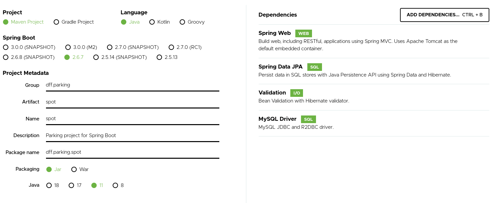

# Projeto Parking

> Projeto exemplificando o gerenciamento de um estacionamento de shopping

O projeto foi desenvolvido durante o bootcamp da CERC promovido pela gama academy

## Passos

1. Fazer essas configurações no site da [Spring](https://start.spring.io/).

2. Gerar o projeto.

3. Descompactar o projeto e abrir numa IDE.

4. O projeto foi dividido por meio do Design Patter MVC a partir das seguintes pastas:
- configs
- controllers
- dtos
- models
- repositories
- services